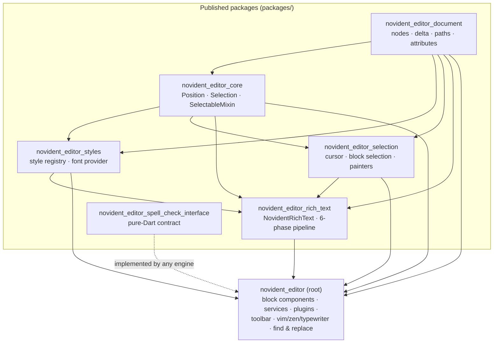
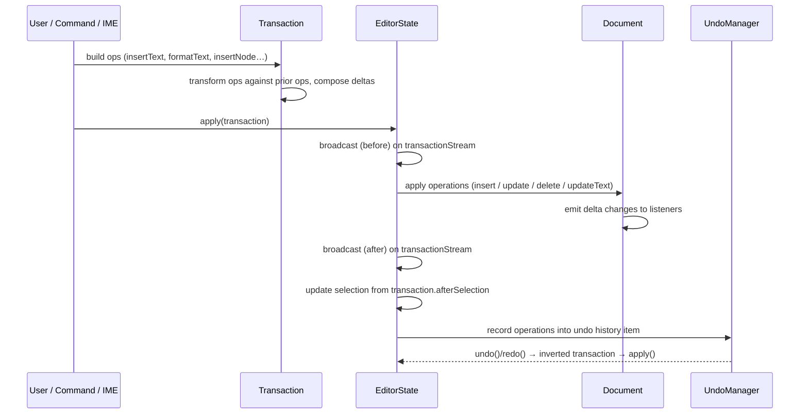
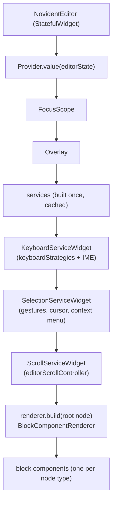
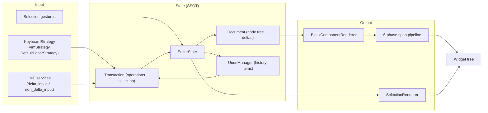

# Novident Editor — Architecture

A high-performance rich-text editor for Flutter, forked from
[AppFlowy Editor](https://github.com/AppFlowy-IO/appflowy-editor) (MPL 2.0).
This document describes how the system is wired together: the data model,
the mutation pipeline, the rendering path, and the feature subsystems.

Companion docs: [`AGENTS.md`](AGENTS.md) (structure & conventions),
[`CONTRIBUTING.md`](CONTRIBUTING.md) (workflow), `documentation/` (feature
guides).

---

## 1. The three-layer mental model

Everything in the editor is built around three objects:

```
Document      →  the tree of nodes (paragraphs, headings, tables…) holding
                 rich-text Deltas and attributes. Pure data, serializable.
EditorState   →  the single mutable state: document, selection, styles,
                 services (undo, spell check, word count). Created once,
                 passed to the editor widget.
NovidentEditor →  the widget. Renders the document, forwards input, and
                 reflects every change back into the EditorState.
```

**All mutations flow through `EditorState.apply(Transaction)`.** Direct
document mutation is possible but discouraged — it bypasses undo/redo,
selection updates, delta-change emission, and collaborative-editing hooks.

---

## 2. Monorepo layout & the "corte" (package extraction)

The original editor was split into layered packages under `packages/`, each
published independently to pub.dev. The root `novident_editor` package
consumes them via **version constraints** (`^1.0.x`), not path deps — the
local `packages/` source is only what gets *published*.



**Layering rules (strict):**

- `novident_editor_document` knows nothing about selection, styles, or
  rendering — only the node tree, rich-text Delta, paths, and attributes.
- `novident_editor_core` depends only on document; `styles` and `selection`
  depend only on document + core; `rich_text` depends on document + core +
  styles + selection.
- The root is the **only** place for block components, editor services,
  plugins, toolbar, vim/zen/typewriter, and find & replace.
- `novident_editor_spell_check_interface` must stay pure Dart — no
  `flutter` import, ever.
- Dependencies only flow upward; a package must never import the root or a
  sibling it doesn't already depend on.

---

## 3. Core data model (`novident_editor_document`)

### Node tree

A `Document` is a tree of `Node`s rooted at a `page` node. Each `Node`
carries:

- **`type`** — a string key that selects which `BlockComponentBuilder`
  renders it (e.g. `paragraph`, `heading`, `table`).
- **`attributes`** — a `Map<String, Object>` of node-level data. Rich text
  lives in the `delta` attribute; other attributes drive block behavior
  (alignment, indentation, subtype…).
- **`children`** — a `LinkedList<Node>` for O(1) sibling insert/remove.

`Node` extends `ChangeNotifier` and `LinkedListEntry<Node>`; every mutation
notifies listeners so the render tree rebuilds. Nodes are addressed by
`Path` (a list of child indices from the root, e.g. `[0, 2]`).

**Performance-critical caches** (all invalidated on mutation):

- **Children cache** — `children` is materialized to a `List` on first
  read; invalidated on every structural change.
- **Index-in-parent cache** — `path` is amortized O(1): the first read
  after a mutation re-indexes all siblings in one sweep (`_reindexChildren`),
  subsequent reads are cache hits.
- **Delta parse cache** — the `delta` getter parses the raw attribute list
  once and caches by identity of the raw value; `updateAttributes` always
  composes a new map, so edits refresh the cache naturally.

### Rich text: Delta

Text content is a Quill-style `Delta` (insert/retain/delete operations with
optional attributes) stored in the node's `delta` attribute. The delta is
the single source of truth for text and inline formatting (bold, italic,
color, links…). `TextDocument`/`DocumentTree` were tried and reverted —
storage is pure Delta by design.

### Delta-change events

`Document.listenDeltaChanges` provides per-node `DeltaChangeEvent`s
(start/end/shift metadata) emitted **after** a transaction applies. This is
the hook spell check and other consumers use to react to edits. Direct
attribute writes never emit — only transactions do.

---

## 4. The mutation pipeline



### Operations (`lib/src/core/transform/operation.dart`)

Four operation types, each invertible (undo/redo is operation inversion):

| Operation | Effect | Invert |
|---|---|---|
| `InsertOperation` | insert nodes at a path | delete them |
| `DeleteOperation` | delete nodes at a path | re-insert them |
| `UpdateOperation` | merge attributes into a node | apply inverted attributes |
| `UpdateTextOperation` | compose a delta into a node's text | compose the inverted delta |

### Transaction (`lib/src/core/transform/transaction.dart`)

A `Transaction` is a list of operations plus selection metadata
(`beforeSelection`, `afterSelection`, `customSelectionType`, `reason`).
Key behaviors:

- **Operation merging** — consecutive `UpdateTextOperation`s on the same
  node compose into one.
- **Path transformation** — `add()` transforms each new operation against
  the already-queued ones so paths stay valid (insert-before shifts).
- **Delta compose map** — text edits (`insertText`, `formatText`,
  `deleteText`, `replaceText`, `mergeText`) accumulate per-node deltas that
  are composed and flushed as a single `UpdateTextOperation` on first read
  of `operations` (lazy `compose()`).
- **Delta-change capture** — each text edit records a `DeltaChange`
  (start/end/shift) at the point where the index is known; the editor emits
  these to document listeners after apply.

### EditorState.apply

`EditorState.apply(transaction)` is the single entry point for mutation:

1. Guards on `editable` / `isDisposed`.
2. Broadcasts `(before, transaction, options)` on the sync and async
   observer streams (collaborative-editing hooks).
3. Applies each operation to the document (`_applyTransactionInLocal`),
   collecting changed nodes.
4. Emits captured delta changes + empty changes for nodes whose delta
   changed without local metadata (undo/redo, paste, remote).
5. Broadcasts `(after, …)`.
6. Records the operations into the undo history item (debounced seal).
7. Updates the selection from `transaction.afterSelection`.

Remote transactions (`isRemote: true`) take a separate path that also
**shifts the local selection** to compensate for remote insert/delete
before the cursor.

### Undo/redo (`lib/src/history/undo_manager.dart`)

- `HistoryItem` collects operations + before/after selection; it can be
  **sealed** (no more ops appended) — sealing is debounced
  (`minHistoryItemDuration`, default 50 ms) so a burst of typing becomes
  one undo step.
- `FixedSizeStack` (default 200 items) backs both stacks.
- `undo()` pops the undo stack, inverts the operations (reverse order),
  and applies with `recordUndo: false, recordRedo: true`.
- `redo()` pops the redo stack and applies normally.

---

## 5. Rendering

### The widget tree (`NovidentEditor`)

`NovidentEditor` (in `lib/src/editor/editor_component/service/editor.dart`)
is a `StatefulWidget` that composes the services around the renderer:



The widget **writes configuration into the EditorState** during
`initState`/`didUpdateWidget` (`_updateValues`): `editorStyle`, `styles`,
`fontProvider`, `editable`, `documentRules`, and the spell-check service
lifecycle. The renderer service is rebuilt from `blockComponentBuilders`
and assigned to `editorState.renderer`.

### Block components

Each node type maps to a `BlockComponentBuilder`
(`lib/src/editor/editor_component/service/renderer/block_component_service.dart`)
that builds a `BlockComponent` widget. The standard map lives in
`standard_block_components.dart`; consumers extend or override it via the
`blockComponentBuilders` parameter. Block components are composable:
shared behavior lives in `base_component/` mixins and commands
(align, indent, outdent, text direction, convert-to-paragraph,
insert-newline-in-type, auto-complete…).

### The 6-phase span pipeline (`novident_editor_rich_text`)

`NovidentRichText` renders a node's delta through an abstract
`NovidentTextSpanPipeline` with exactly six phases:

```
per TextInsert:  1 resolveStyle → 2 transformText → 3 emitSpans
per node:        4 paintSelectionContrast (over the emitted spans)
placeholder:     5 buildPlaceholder
per node:        6 adjustSpan (over the root span)
```

- **Phase 1** converts attributes → `TextStyle` (over the base style). It
  also receives the `node` and `buildContext` (optional) so pipelines can
  react to the node's surroundings (e.g. zen-mode color dimming).
- **Phase 2** applies textual transforms (caps/smallCaps) — must not change
  UTF-16 length, since document offsets are measured on the original text.
- **Phase 3** emits spans — may split text (spell-check marks, syntax
  highlighting); returned spans must cover the text exactly.
- **Phase 4** applies selection contrast over emitted spans.
- **Phase 5** builds the placeholder of an empty node.
- **Phase 6** final root-span adjustment (caret-height workaround).

Implementations must be stateless w.r.t. the phases (any phase may run any
number of times per build). `DefaultNovidentTextSpanPipeline` reproduces
legacy behavior; `SpellCheckSpanPipeline` plugs in at phase 3 to underline
misspelled words.

**Pipeline composition:** `EditorState.spanPipeline` is the single
composition point (every block component passes `editorConfig: editorState`).
Optional modes register a wrapper via `setSpanPipelineWrapper` that composes
over the effective pipeline (spell check or default) — e.g. `ZenSpanPipeline`
wraps it as a delegate and only overrides `resolveStyle` for the dimming,
keeping the modes decoupled.

### Selection rendering (`novident_editor_selection`)

`SelectionRenderer` is the full control surface for cursor and selection
appearance and movement behavior (build cursor, paint selection rects,
movement callbacks, lifecycle events). The deprecated head-cursor methods
(`buildExpandedHeadCursor`, `paintExpandedHeadCursor`,
`expandedHeadPosition`) are replaced by computing the head and injecting it
into the rects in `onSelectionRectsMeasured` (see `VimSelectionRenderer`).
`EditorStyle.selectionRenderer` selects the implementation; the default is
`DefaultSelectionRenderer`.

---

## 6. Input handling

### Keyboard: composable `KeyboardStrategy` policies

Physical-keyboard interpretation is a list of `KeyboardStrategy` policies
consulted in order — the first one that does not return `ignored` wins.
`DefaultEditorStrategy` wraps the classic character/command shortcut event
lists; `VimStrategy` intercepts keys outside insert mode. The deprecated
`characterShortcutEvents`/`commandShortcutEvents` widget parameters are
bridged into a `DefaultEditorStrategy` when `keyboardStrategies` is empty.

### IME (`service/ime/`)

Text input from soft keyboards / IMEs goes through the IME services:
`DeltaInputService` (delta-driven input), `NonDeltaInputService`
(plain-text fallback), `TextDiff` (diffing composed text), and the
`delta_input_on_*` implementations (insert, delete, replace, non-text
update, action update, floating cursor). This layer is what makes Korean/
Japanese IME composition work.

### Selection gestures (`service/selection/`)

`SelectionGesture` (desktop) and `MobileSelectionGesture` (touch) translate
pointer events into selection updates through `updateSelectionWithReason`,
which routes through the active `SelectionRenderer` and completes after the
frame for UI events.

---

## 7. Services (`EditorService`)

`EditorState.service` is an `EditorService` holding GlobalKeys into the
widget tree's service widgets:

| Service | Key | Role |
|---|---|---|
| `rendererService` | — (assigned) | `BlockComponentRenderer` — maps node type → builder |
| `selectionService` | `selectionServiceKey` | selection state, gestures, context menu |
| `keyboardService` | `keyboardServiceKey` | keyboard strategies + IME input |
| `scrollService` | `scrollServiceKey` | scrolling, auto-scroll |

Services are resolved lazily through their GlobalKeys (asserting the widget
is mounted); the renderer is assigned directly by the editor widget.

---

## 8. Feature subsystems

### Vim mode (`lib/src/editor/vim_mode/`)

`VimModeController` coordinates vim emulation: it owns the mode
(normal/insert/visual), the pending operator buffer, and a `configuration`
that can be rebound at runtime. `VimStrategy` (a `KeyboardStrategy`) blocks
IME input outside insert mode — the mode is the strategy's hardware↔IME
correlation. `VimSelectionRenderer` paints the block cursor and injects the
selection head into measured rects. `vimKeyboardStrategies(controller)`
returns the strategy list to pass to the editor.

### Zen mode (`lib/src/editor/zen_mode/`)

`ZenModeController` (a `ValueNotifier<ZenModeConfiguration>`) dims unfocused
blocks **without touching the document**: text/block colors are neutralized
through the span pipeline (`ZenSpanPipeline`, which wraps the effective
pipeline as a delegate) and the block background decorator. `ZenModeBlock` +
`ZenModeScope` provide the per-block dimmed state with **O(1) rebuilds**:
each wrapper listens to the controller's focused top-level range and only
rebuilds when its own dimmed state flips — typing inside a block rebuilds
nothing. Only non-text node types (e.g. images, filterable via
`wrapNonTextTypes`) get a cheap static `Opacity` wrapper, since they have no
text spans to style. Typewriter scrolling is a separate feature — see below.

### Typewriter scrolling (`lib/src/editor/typewriter/`)

`TypewriterScrollStrategy` (a `ScrollStrategy`) keeps the cursor vertically
centered by driving the `EditorScrollController` on selection changes. It is
independent from zen mode (usable with or without it) and is passed to
`NovidentEditor.scrollStrategies`. It centers **instantly** for collapsed
selections and **delegates to the default edge-follow** for expanded ones.

The scroll system is decomposed into reusable pieces under
`service/scroll/`: `ScrollTargetResolver` (edge policy), `ScrollVelocity`
(velocity profile) and `ScrollDriver` (the follow loop), composed by
`AutoScroller`. `ScrollStrategy` is the full-control seam (like
`KeyboardStrategy`): the editor delegates, the strategy decides.

### Spell check (`lib/src/editor/spell_check/`)

Out-of-band, Word-like analysis:

1. `SpellCheckService` listens to document delta changes and marks affected
   nodes pending.
2. A single global inactivity timer (debounce, default 600 ms) restarts on
   every change; pending nodes accumulate while typing.
3. On expiry, each pending node is re-analyzed **entirely** and
   `proofState: 'error'` marks are injected into its delta.

Marks are written **directly** via `node.updateAttributes` — never through
transactions and never through `emitChanges` — so analysis can never loop
on itself. The checker itself implements the pure-Dart
`NovidentSpellChecker` contract (`novident_editor_spell_check_interface`);
the reference Hunspell `en_US` implementation lives in `example/lib/spell_check/`
with parsing/affix/suggestions in a worker isolate.

### Named styles (`novident_editor_styles`)

`NovidentStyleRegistry` holds `NovidentStyleDefinition`s with `basedOn`
inheritance; resolution is a three-tier fallback (explicit style → type
default → global default). Base styles require `fontSize`, `fontFamily`,
and `textColor`. `NovidentFontProvider` supplies available font families
and a guaranteed non-null default. Toolbar items resolve the current value
through the same chain.

### Tables (`lib/src/editor/block_component/table_block_component/`)

Tables are a weight-based column layout filling the available width, with
reusable `TableStyleDefinition`s (zebra striping, colored headers,
borderless). `TableNode.fromList` builds the node tree; `table_commands.dart`
provides the keyboard commands; `table_action_menu.dart` the row/column
actions. See `documentation/tables.md` and
`documentation/components/table-architecture.md`.

### Find & replace (`lib/src/editor/find_replace_menu/`)

Search over the document with match highlighting (search results drive
selection via `SelectionUpdateReason.searchHighlight`) and replace
operations applied through transactions.

### Plugins: import/export (`lib/src/plugins/`)

| Format | Decoder | Encoder |
|---|---|---|
| HTML | `html_document_decoder.dart` | `html/encoder/` (per-node parsers) |
| Markdown | `markdown/decoder/` (parser + custom syntaxes) | `markdown/encoder/` (per-node parsers) |
| Quill Delta | — | `quill_delta_encoder.dart` |
| Word count | — | `word_counter_service.dart` |

Each format follows the same shape: `decoder/` and `encoder/` subdirs with
per-node parsers, exposed as `Codec<Document, String>` implementations
(`NovidentEditorHTMLCodec`, `NovidentEditorMarkdownCodec`).

---

## 9. Localization

- **Sources**: ARB files in `lib/l10n/intl_*.arb` (23 locales).
- **Generated**: `lib/src/l10n/intl/messages_*.dart` via
  `flutter pub run intl_utils:generate` — analyzer-excluded, never
  hand-edited.
- **Runtime strings**: `NovidentEditorL10n` (extends the generated
  `NovidentEditorLocalizations`); the public delegate is
  `NovidentEditorLocalizations.delegate`.

---

## 10. Performance characteristics

- **Path resolution is amortized O(1)** via the per-parent index cache
  (one re-index sweep per mutation, then cache hits) — paths are resolved
  constantly (selections, rendering, transactions).
- **Delta parsing is cached** per raw attribute identity — the hot
  `node.delta` getter never re-parses an unchanged attribute list.
- **Children lists are cached** and invalidated on structural change.
- **Spell check never runs on the typing hot path** — whole-node
  re-analysis only after the idle timeout, O(1) per word against a Trie.
- **Selection rects are computed fresh per call** — global coordinates
  depend on scroll offset, so caching across frames would return stale
  positions during scroll animations.
- **Zen dimming is O(1) per focus change** — each block's `ZenModeBlock`
  only rebuilds when its own dimmed state flips; typing inside a block
  rebuilds no wrapper. Config refreshes notify only the visible nodes
  (`getVisibleNodes`), with a platform-sized fallback window when the
  visible range is not initialized.
- **`shrinkWrap: false` (default) uses a ListView** for virtualized
  rendering; `shrinkWrap: true` falls back to SingleChildScrollView +
  Column (documented as poor performance for large documents).

---

## 11. Data flow summary



**The invariant**: every mutation enters through `EditorState.apply` as a
`Transaction`; the document is the source of truth; the widget tree is a
pure function of `EditorState` + `Document`; and every change is observable
through the transaction streams and delta-change events for collaboration
and analysis features.
