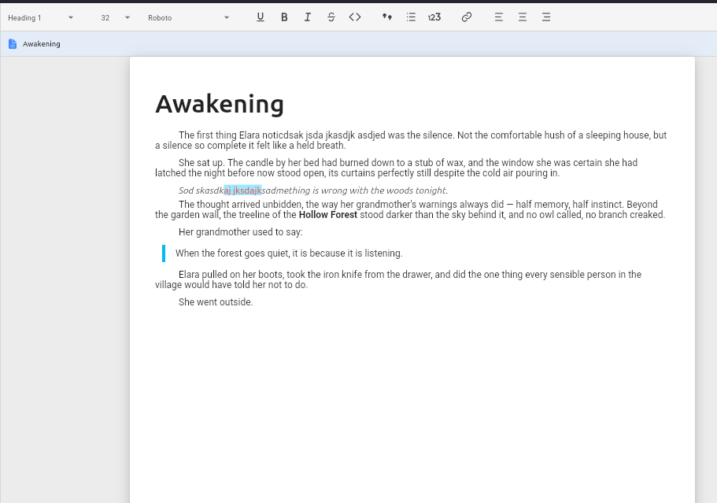

<h1 align="center"><b>Novident Editor</b></h1>
<p align="center">A high-performance rich-text editor for Flutter — part of the <a href="https://github.com/Novident">Novident</a> suite.</p>
<p align="center">
    Fork of <a href="https://github.com/AppFlowy-IO/appflowy-editor"><b>AppFlowy Editor</b></a>,
    used under the <a href="LICENSE">Mozilla Public License 2.0</a>.
    See <a href="NOTICE">NOTICE</a> for attribution.
</p>

Novident Editor is a **drop-in rich-text editor** for Flutter apps. It renders a document
tree built from composable block components — paragraphs, headings, lists, quotes, images,
tables and more.



## Unique Features

- **Vim emulation** (normal / insert / visual, remappable keybindings, pending operator `dd`)
- **Zen mode** (typewriter centering, unfocused-block dimming, color neutralization without
  touching the document)
- **Aggressive caching** throughout the document model, selection pipeline and text
  rendering
- **Named paragraph styles** with `basedOn` inheritance chains, similar to Word —
  font family, font size, bold, italic, spacing, colours and more, all resolved
  through a three-tier fallback (explicit style → type default → global default)
  and exposed through customisable toolbar dropdowns
- **First-line indent** per style (`NovidentStyleIndent.firstLineIndent`) or
  globally (`EditorStyle.firstLineIndent`) 
- **Full control over tables** using **NovidentTableStyleDefinition** and new configurations for tables.
- **Extracted important layers** of the editor API like the rich text component, the selection components, the core elements of the editor, and the document format that avoid using the whole editor for small things

> [!NOTE]
> Planned: 
>
> 1. Improve perfomance on Zen Mode.
> 2. Full customization of every default block.
> 3. Improve clipboard copy+paste content (now it copies pure plain text) 
> 4. Translations
> 5. Typewriting Scrolling without Zen Mode.
> 6. Uncouple important parts of the editor into individual packages (block components, keyboard service, scroll service, etc)

## If you were using version 1.0.4

See [migration to 1.0.4](./documentation/migrations/1.0.3_to_1.0.4.md)

## Quick start

```dart
import 'package:novident_editor/novident_editor.dart';
import 'package:flutter_localizations/flutter_localizations.dart';

void main() {
  runApp(const MyApp());
}

class MyApp extends StatelessWidget {
  const MyApp({super.key});

  @override
  Widget build(BuildContext context) {
    return MaterialApp(
      localizationsDelegates: const [
        NovidentEditorLocalizations.delegate,
        GlobalMaterialLocalizations.delegate,
        GlobalWidgetsLocalizations.delegate,
        GlobalCupertinoLocalizations.delegate,
      ],
      home: Scaffold(
        body: NovidentEditor(
          editorState: EditorState.blank(withInitialText: true),
        ),
      ),
    );
  }
}
```

Or hydrate the editor from JSON / Markdown / Quill Delta — see
[Importing content](documentation/importing.md).

---

## Vim mode

Vim emulation is built into the package — no extra dependency. Every keybinding is
remappable at runtime, and changing bindings **does not rebuild the editor**:

```dart
final vimController = VimModeController();

NovidentEditor(
  editorState: editorState,
  editorStyle: EditorStyle.desktop(
    // The vim renderer paints a block cursor in normal/visual mode.
    // Insert mode keeps the standard thin caret.
    selectionRenderer: VimSelectionRenderer(
      controller: vimController,
    ),
  ),
  commandShortcutEvents: [
    ...vimController.commandShortcutEvents,
    ...standardCommandShortcutEvents,
  ],
);

// After the editor is mounted:
vimController.attach(editorState);

// Remap any key at runtime:
vimController.configuration =
    vimController.configuration.rebind(VimCommand.moveLeft, 'a', rawCommand: null);
```

### Customising the block cursor

The block cursor color defaults to `EditorStyle.cursorColor`. Configure width,
blink, and opacity through `VimCursorStyle`:

```dart
final vimController = VimModeController(
  configuration: VimModeConfiguration(
    cursorStyle: VimCursorStyle(
      color: Colors.purple,
      opacity: 0.55,
      blink: false,
    ),
  ),
);
```

Change it at runtime without rebuilding:

```dart
vimController.configuration = vimController.configuration.copyWith(
  cursorStyle: const VimCursorStyle(blockWidth: 20, blink: true),
);
```

A `VimModeChip` widget is available in the example for status bars. Modes, the pending `dd` operator
and the block-cursor style are all observable via `vimController`.

You can also define your own `VimCommand` instances to extend the built-in set —
indent / outdent, custom insertions, or any editor operation.  See the full guide
at **[Vim Commands](documentation/vim-commands.md)**.

---

## Zen mode

Zen mode dims every top-level block that is **not** focused (animatable opacity),
ignores text / highlight / block-background colors (they stay in the document — disable
zen and they come back), and keeps the focused block vertically centered
(typewriter scrolling):

```dart
final zenController = ZenModeController();

NovidentEditor(
  editorState: editorState,
  editorScrollController: editorScrollController,
  blockWrapper: zenController.blockWrapper,
  editorStyle: EditorStyle.desktop(
    textSpanDecorator: zenController.textSpanDecorator(),
  ),
);
```

All colours (`font_color`, `bg_color`, block `bgColor`) are ignored **without ever
mutating the delta or the node attributes** — the visual pipeline neutralises them
while the `blockWrapper` dims the unfocused blocks. This means zen mode can be toggled
on and off with zero document churn.

---

## Word & character counter

Each `EditorState` can be connected to a `WordCountService` that debounces on
transactions and exposes `documentCounters` / `selectionCounters` through a
`ChangeNotifier`. Use a `ListenableBuilder` to build a live counter chip:

```dart
final counter = WordCountService(editorState: editorState)..register();

ListenableBuilder(
  listenable: counter,
  builder: (context, _) => Text(
    '${counter.documentCounters.wordCount} words  '
    '${counter.documentCounters.charCount} chars',
  ),
);
```

---

## Styles

Novident Editor includes a **named paragraph style system** with `basedOn`
inheritance — define a base style once and every derived style inherits its
font, size, spacing and colours automatically:

> [!IMPORTANT]
> Base styles require to have defined: `fontSize`, `fontFamily` and `textColor` properties always

```dart
NovidentEditor(
  editorState: editorState,
  styles: NovidentStylesConfig(
    registry: NovidentStyleRegistry({
      'base': NovidentStyleDefinition(
        id: 'base', 
        name: 'Base',
        fontSize: 12, 
        fontFamily: 'Arial',
        indent: NovidentStyleIndent.defaultLineFilter(),
      ),
      'body': NovidentStyleDefinition.nextSame(
        id: 'body', 
        name: 'Body',
        basedOn: 'base',
        spacing: NovidentStyleSpacing(after: 8),
      ),
      'heading-1': NovidentStyleDefinition(
        id: 'heading-1', 
        name: 'Heading 1',
        basedOn: 'base',
        fontSize: 32, 
        bold: true,
        spacing: NovidentStyleSpacing(before: 24, after: 12),
        next: 'body',
      ),
    }),
    defaultStyle: /* base */,
    defaultStylesByType: {'paragraph': /* body */, 'heading': /* heading-1 */},
  ),
);
```

Three toolbar items ship out of the box:

| Item | What it does |
|------|-------------|
| `styleToolbarItem` | Dropdown — applies a named style to the current block |
| `buildFontFamilyItem(fontFamilies: [...])` | Dropdown — applies inline font family |
| `buildFontSizeItem(minSize: 1, maxSize: 99)` | Scrollable dropdown — applies inline font size |

All three resolve the **current** value by checking inline delta attributes
first, then the resolved node style (through the `basedOn` chain), and
finally a hard default. Colours and tooltips are fully customisable via the
standard toolbar theming parameters.

Font families are managed through `NovidentFontProvider` — inject your own
list (or use `system_fonts` on desktop) and the editor guarantees every
style resolves to a non-null font:

```dart
NovidentEditor(
  fontProvider: NovidentFontProvider.fromList(
    ['Arial', 'Times New Roman', 'Georgia'],
    defaultFamily: 'Arial',
  ),
);
```

See **[Styles — full guide](documentation/styles.md)** for every property,
the resolution algorithm, the font provider, and how to build your own
style registry.


## Customising block components

Overriding a built-in block or adding a new one is done via
`blockComponentBuilders` — the `standardBlockComponentBuilderMap` is a
convenient base that you can spread and override:

```dart
NovidentEditor(
  editorState: editorState,
  blockComponentBuilders: {
    ...standardBlockComponentBuilderMap,
    'my_custom_type': MyCustomBlockBuilder(),
  },
);
```

See [`documentation/customizing.md`](documentation/customizing.md) for a
detailed walkthrough.

---

## Tables

Tables render with a weight-based column layout that fills available width.
Define reusable table styles with `NovidentTableStyleDefinition` for zebra
striping, coloured headers, borderless layouts, and more.

```dart
final table = TableNode.fromList([
  ['Name', 'Elara'],   // column 0
  ['Role', 'Mage'],    // column 1
]);
editorState.insertNode(path, table.node);
```

See **[Tables — full guide](documentation/tables.md)** for creation,
styling, column weights, keyboard shortcuts, and the complete property
reference.

---

## License

Novident Editor is a fork of **AppFlowy Editor**
([AppFlowy-IO/appflowy-editor](https://github.com/AppFlowy-IO/appflowy-editor)).
Upstream is dual-licensed under the GNU Affero General Public License v3 and the
Mozilla Public License 2.0.

This fork is used and distributed under the **Mozilla Public License 2.0**.
See [LICENSE](LICENSE) and [NOTICE](NOTICE) for full details.
