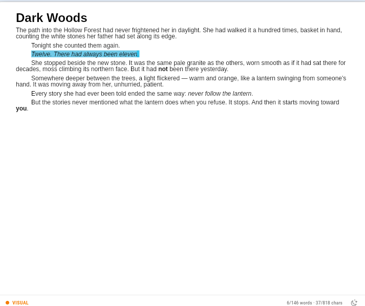

<h1 align="center"><b>Novident Editor</b></h1>
<p align="center">A high-performance rich-text editor for Flutter — part of the <a href="https://github.com/Novident">Novident</a> suite.</p>

<p align="center">
    <a href="https://pub.dev/packages/novident_editor"></a>
    <a href="LICENSE"></a>
    <a href="https://github.com/Novident/novident-editor/issues"></a>
</p>

<p align="center">
    Fork of <a href="https://github.com/AppFlowy-IO/appflowy-editor"><b>AppFlowy Editor</b></a>,
    used under the <a href="LICENSE">Mozilla Public License 2.0</a>.
    See <a href="NOTICE">NOTICE</a> for attribution.
</p>

Novident Editor is a **drop-in rich-text editor** for Flutter. It renders a document
tree built from composable block components — paragraphs, headings, lists, quotes,
images and tables — with vim emulation, named paragraph styles, zen mode and
spell checking out of the box.



## Quick start

```dart
import 'package:novident_editor/novident_editor.dart';
import 'package:flutter_localizations/flutter_localizations.dart';

void main() {
  runApp(const MyApp());
}

class MyApp extends StatelessWidget {
  const MyApp({super.key});

  @override
  Widget build(BuildContext context) {
    return MaterialApp(
      localizationsDelegates: const [
        NovidentEditorLocalizations.delegate,
        GlobalMaterialLocalizations.delegate,
        GlobalWidgetsLocalizations.delegate,
        GlobalCupertinoLocalizations.delegate,
      ],
      home: Scaffold(
        body: NovidentEditor(
          editorState: EditorState.blank(withInitialText: true),
        ),
      ),
    );
  }
}
```

## Core concepts

The editor is built around three layers:

```
Document  →  the tree of nodes (paragraphs, headings, tables…) holding
             rich-text Deltas and attributes. Pure data, serializable.
EditorState  →  the single mutable state: document, selection, styles,
             services (undo, spell check, word count). Created once,
             passed to the editor widget.
NovidentEditor  →  the widget. Renders the document, forwards input, and
             reflects every change back into the EditorState.
```

Everything you do programmatically goes through `EditorState`.

### Read and write content

```dart
final editorState = EditorState.blank(withInitialText: true);
final node = editorState.document.first!;

// Write: insert text at offset 0 (with attributes) through a transaction
editorState.apply(
  editorState.transaction
    ..insertText(node, 0, 'Hello ', attributes: {'bold': true})
    ..insertText(node, 6, 'Novident'),
);

// Format a range
editorState.apply(
  editorState.transaction
    ..formatText(node, 0, 5, {'italic': true}),
);

// Read: plain text, delta, or the whole document as JSON
print(node.delta!.toPlainText());       // "Hello Novident"
print(editorState.document.toJson());   // persistable structure

// Selection, undo/redo
editorState.selection = Selection.collapsed(
  Position(path: node.path, offset: 5),
);
editorState.undoManager.undo();
editorState.undoManager.redo();
```

Hydrate the editor from JSON, Markdown, or Quill Delta — see
[Importing content](documentation/importing.md).

## Features

### Named paragraph styles

A **named style system with `basedOn` inheritance** — define a base style once and
every derived style inherits font, size, spacing and colours, resolved through a
three-tier fallback (explicit style → type default → global default):

```dart
NovidentEditor(
  editorState: editorState,
  styles: NovidentStylesConfig(
    registry: NovidentStyleRegistry({
      'base': NovidentStyleDefinition(
        id: 'base', name: 'Base',
        fontSize: 12, fontFamily: 'Arial',
        indent: NovidentStyleIndent.defaultLineFilter(),
      ),
      'body': NovidentStyleDefinition.nextSame(
        id: 'body', name: 'Body', basedOn: 'base',
        spacing: NovidentStyleSpacing(after: 8),
      ),
      'heading-1': NovidentStyleDefinition(
        id: 'heading-1', name: 'Heading 1', basedOn: 'base',
        fontSize: 32, bold: true,
        spacing: NovidentStyleSpacing(before: 24, after: 12),
        next: 'body',
      ),
    }),
  ),
);
```

> [!IMPORTANT]
> Base styles require `fontSize`, `fontFamily` and `textColor` to be defined.

Toolbar items (`styleToolbarItem`, `buildFontFamilyItem`, `buildFontSizeItem`)
resolve the current value through the same chain. See
**[Styles — full guide](documentation/styles.md)**.

### Tables

Tables render with a weight-based column layout that fills the available width,
with reusable style definitions for zebra striping, coloured headers and
borderless layouts:

```dart
final table = TableNode.fromList([
  ['Name', 'Elara'],   // column 0
  ['Role', 'Mage'],    // column 1
]);
editorState.apply(editorState.transaction..insertNode(path, table.node));
```

See **[Tables — full guide](documentation/tables.md)**.

### Vim emulation

Built into the package — no extra dependency. Every keybinding is remappable at
runtime without rebuilding the editor:

```dart
final vimController = VimModeController();

NovidentEditor(
  editorState: editorState,
  editorStyle: EditorStyle.desktop(
    // Block cursor in normal/visual mode; thin caret in insert mode.
    selectionRenderer: VimSelectionRenderer(controller: vimController),
  ),
  commandShortcutEvents: [
    ...vimController.commandShortcutEvents,
    ...standardCommandShortcutEvents,
  ],
);

vimController.attach(editorState);
vimController.configuration =
    vimController.configuration.rebind(VimCommand.moveLeft, 'a', rawCommand: null);
```

See **[Vim Commands](documentation/vim-commands.md)** for the full command set,
custom commands, and cursor styling.

### Zen mode

Dims unfocused blocks, neutralises text/block colours **without touching the
document**, and keeps the focused block vertically centered (typewriter scroll):

```dart
final zenController = ZenModeController();

NovidentEditor(
  editorState: editorState,
  editorScrollController: editorScrollController,
  blockWrapper: zenController.blockWrapper,
  editorStyle: EditorStyle.desktop(
    textSpanDecorator: zenController.textSpanDecorator(),
  ),
);
```

### Spell checking

Spell checking plugs in through the engine-agnostic
[`novident_spell_check_interface`](https://pub.dev/packages/novident_spell_check_interface)
contract. The editor runs the analysis **out of band** (after typing inactivity),
stores the marks in the document delta, and the render pipeline underlines them —
no checker call ever runs inside `build`:

```dart
final checker = MySpellChecker(); // implements NovidentSpellChecker

NovidentEditor(
  editorState: editorState,
  editorStyle: EditorStyle.desktop(
    spellChecker: checker,
    spellCheckMisspelledStyle: const TextStyle(
      decoration: TextDecoration.underline,
      decorationStyle: TextDecorationStyle.wavy,
      decorationColor: Colors.red,
    ),
    // Idle debounce before re-analysis (default 600 ms)
    spellCheckDebounce: const Duration(milliseconds: 600),
  ),
);
```

```dart
class MySpellChecker extends NovidentSpellChecker {
  final Set<String> dictionary = {'hello', 'world'};

  @override String? get language => 'en';

  @override
  bool isValid(String word) => dictionary.contains(word.toLowerCase());

  @override
  List<SpellCheckIssue> check(String text) { /* tokenize + validate */ }

  @override
  List<String> suggest(String word) =>
      dictionary.where((w) => w.startsWith(word[0])).toList();
}
```

The reference implementation lives in the example app: a full Hunspell `en_US`
checker whose parsing, affix expansion and suggestion index live in a **worker
isolate** (`example/lib/spell_check/`), so even the whole dictionary never
touches the UI isolate. Suggestions reach context menus through the async
`suggestAsync` contract entry point.

### Word & character counter

```dart
final counter = WordCountService(editorState: editorState)..register();

ListenableBuilder(
  listenable: counter,
  builder: (context, _) => Text(
    '${counter.documentCounters.wordCount} words  '
    '${counter.documentCounters.charCount} chars',
  ),
);
```

### Customising block components

Override a built-in block or register a new one through
`blockComponentBuilders`:

```dart
NovidentEditor(
  editorState: editorState,
  blockComponentBuilders: {
    ...standardBlockComponentBuilderMap,
    'my_custom_type': MyCustomBlockBuilder(),
  },
);
```

See [`documentation/customizing.md`](documentation/customizing.md) for a
detailed walkthrough.

## Complete example

A realistic setup combining styles, spell checking and a word counter:

```dart
import 'package:flutter/material.dart';
import 'package:novident_editor/novident_editor.dart';

class EditorPage extends StatefulWidget {
  const EditorPage({super.key});

  @override
  State<EditorPage> createState() => _EditorPageState();
}

class _EditorPageState extends State<EditorPage> {
  final EditorState editorState = EditorState.blank(withInitialText: true);
  late final WordCountService _counter = WordCountService(
    editorState: editorState,
  )..register();

  @override
  void dispose() {
    _counter.dispose();
    editorState.dispose();
    super.dispose();
  }

  @override
  Widget build(BuildContext context) {
    return Column(
      children: [
        Expanded(
          child: NovidentEditor(
            editorState: editorState,
            editorStyle: EditorStyle.desktop(
              spellChecker: MySpellChecker(),
              spellCheckMisspelledStyle: const TextStyle(
                decoration: TextDecoration.underline,
                decorationStyle: TextDecorationStyle.wavy,
                decorationColor: Colors.red,
              ),
            ),
          ),
        ),
        ListenableBuilder(
          listenable: _counter,
          builder: (context, _) => Text(
            '${_counter.documentCounters.wordCount} words  '
            '${_counter.documentCounters.charCount} chars',
          ),
        ),
      ],
    );
  }
}
```

## Packages

The editor's core layers are published as standalone packages — use them when
you need one piece without the full editor:

| Package | What it provides | Use it for |
|---|---|---|
| [`novident_document`](https://pub.dev/packages/novident_document) | Document tree, rich-text Deltas, delta-change events | Document models, storage, offline-first apps |
| [`novident_editor_core`](https://pub.dev/packages/novident_editor_core) | Core editor primitives (RichText rendering base) | Low-level rendering work |
| [`novident_editor_styles`](https://pub.dev/packages/novident_editor_styles) | Style definitions and resolution | Custom style engines |
| [`novident_editor_selection`](https://pub.dev/packages/novident_editor_selection) | Selection model, renderers, painters | Custom selection UIs |
| [`novident_editor_rich_text`](https://pub.dev/packages/novident_editor_rich_text) | `NovidentRichText` + the 6-phase span pipeline | Paragraph rendering, custom decorations |
| [`novident_spell_check_interface`](https://pub.dev/packages/novident_spell_check_interface) | The spell-checker contract (`NovidentSpellChecker`) | Building or swapping spell-check engines |

## Documentation

- **[Styles](documentation/styles.md)** — named styles, `basedOn` resolution, font provider, toolbar items
- **[Tables](documentation/tables.md)** — creation, styling, weights, shortcuts
- **[Vim commands](documentation/vim-commands.md)** — the command set, remapping, custom commands
- **[Customising blocks](documentation/customizing.md)** — overriding and creating block components
- **[Importing content](documentation/importing.md)** — JSON, Markdown, Quill Delta
- **[Testing](documentation/testing.md)** — the test helpers used across the project

## Migrating

If you were using version 1.0.4, see
[migration to 1.0.4](./documentation/migrations/1.0.3_to_1.0.4.md).

## Roadmap

- Improve Zen mode performance.
- Full customization of every default block.
- Richer clipboard copy/paste (currently plain text).
- Translations.
- Typewriter scrolling without Zen mode.
- Uncouple remaining editor parts into individual packages (block
  components, keyboard service, scroll service…).

## License

Novident Editor is a fork of **AppFlowy Editor**
([AppFlowy-IO/appflowy-editor](https://github.com/AppFlowy-IO/appflowy-editor)).
Upstream is dual-licensed under the GNU Affero General Public License v3 and the
Mozilla Public License 2.0.

This fork is used and distributed under the **Mozilla Public License 2.0**.
See [LICENSE](LICENSE) and [NOTICE](NOTICE) for full details.
