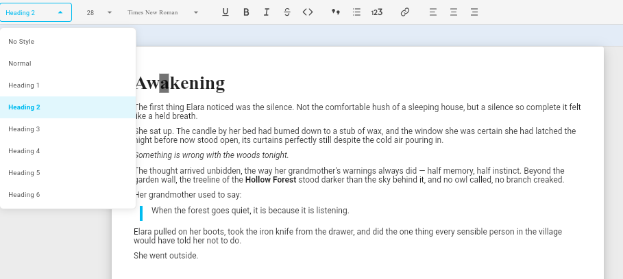

# Style System

Novident Editor ships with a **named paragraph style system** modelled after
word processors like Microsoft Word. Every paragraph can reference a reusable,
named style that defines its visual appearance — font family, font size, bold,
italic, spacing, alignment, colours, and more.

Styles are **resolved through an inheritance chain** (`basedOn`) and can be
applied, changed, or cleared at runtime through the toolbar or
programmatically.

---

## Architecture

```
┌──────────────────────────────────────────────────┐
│ NovidentStylesConfig                             │
│  ├─ registry: NovidentStyleRegistry              │
│  │    └─ Map<String, NovidentStyleDefinition>    │
│  ├─ defaultStyle: NovidentStyleDefinition        │
│  └─ defaultStylesByType: Map<String, ...>        │
└──────────────────────────────────────────────────┘
         │
         │  provided via InheritedWidget
         ▼
┌──────────────────────────────────────────────────┐
│ NovidentEditorStyles (InheritedWidget)            │
│  └─ resolveStyle(Node) → NovidentStyleDefinition │
│       1. node.attributes['styleRef'] → registry  │
│       2. defaultStylesByType[node.type]           │
│       3. config.defaultStyle                     │
└──────────────────────────────────────────────────┘
         │
         │  registry.resolve(id)
         ▼
┌──────────────────────────────────────────────────┐
│ NovidentStyleRegistry                            │
│  └─ resolve(id) → walks basedOn chain, merges    │
│       parent.merge(child)                        │
└──────────────────────────────────────────────────┘
```

---

## Quick start

```dart
import 'package:novident_editor/novident_editor.dart';

// 1 — Define styles
const myStyles = NovidentStyleRegistry({
  'base': NovidentStyleDefinition(
    id: 'base',
    name: 'Base',
    fontSize: 12,
    fontFamily: 'Arial',
  ),
  'body': NovidentStyleDefinition.nextSame(
    id: 'body',
    name: 'Body',
    basedOn: 'base',               // inherits fontSize 12, fontFamily Arial
    spacing: NovidentStyleSpacing(after: 8),
  ),
  'heading-1': NovidentStyleDefinition(
    id: 'heading-1',
    name: 'Heading 1',
    basedOn: 'base',               // inherits fontFamily Arial
    fontSize: 32,                  // overrides fontSize
    bold: true,
    spacing: NovidentStyleSpacing(before: 24, after: 12),
    next: 'body',                  // Enter → next paragraph uses 'body'
  ),
});

// 2 — Wire them into the editor
NovidentEditor(
  editorState: editorState,
  styles: NovidentStylesConfig(
    registry: myStyles,
    // font family and font size 
    // must be defined for default style
    //
    // if not, this will throw an assertio error
    defaultStyle: myStyles.styles['body']!,
    defaultStylesByType: {
      'paragraph': myStyles.styles['body']!,
      'heading': myStyles.styles['heading-1']!,
    },
  ),
);
```

Now every toolbar that shows styles (`styleToolbarItem`) will list "Base",
"Body", and "Heading 1". Selecting one applies its `id` as the block's
`styleRef` attribute, and the renderer resolves the full definition through
the `basedOn` chain.

---

## Style resolution (basedOn chain)

When a block has `styleRef: 'heading-1'`, the renderer calls:

```dart
final style = registry.resolve('heading-1');
```

`resolve` walks the `basedOn` chain backwards:

```
heading-1  →  basedOn: 'base'
  base     →  no basedOn (root)
```

Then merges **parent-first** so child properties override parent:

```
base.fontSize    = 12      ─┐
base.fontFamily  = 'Arial'  ├─ merge
heading-1.fontSize = 32    ─┘  →  fontSize: 32, fontFamily: 'Arial'
```

Cyclic `basedOn` references are detected and silently broken (the chain
stops at the cycle point).

### Three-tier fallback

`NovidentEditorStyles.resolveStyle(node)` resolves the effective style in
three steps:

| Priority | Source | Example |
|----------|--------|---------|
| 1 | `node.attributes['styleRef']` → `registry.resolve(id)` | Block explicitly styled as "heading-1" |
| 2 | `config.defaultStylesByType[node.type]` | All `heading` blocks default to heading-1 style |
| 3 | `config.defaultStyle` | Catch-all fallback (e.g., "body") |

---

## Style properties

`NovidentStyleDefinition` supports all properties a block component can
render:

| Property | Type | Description |
|----------|------|-------------|
| `id` | `String` | Unique identifier (used as `styleRef`) |
| `name` | `String` | Human-readable label (shown in toolbar) |
| `basedOn` | `String?` | Parent style ID to inherit from |
| `next` | `String?` | Style applied to the next paragraph after Enter |
| `fontFamily` | `String?` | CSS font family name |
| `fontSize` | `double?` | Font size in logical pixels (default 12) |
| `bold` | `bool?` | Bold weight |
| `italic` | `bool?` | Italic |
| `underline` | `bool?` | Underline |
| `strikethrough` | `bool?` | Strikethrough |
| `caps` | `bool?` | All caps |
| `smallCaps` | `bool?` | Small caps |
| `textColor` | `Color?` | Text foreground colour |
| `textBackgroundColor` | `Color?` | Text highlight colour |
| `alignment` | `TextAlign?` | Paragraph alignment (default left) |
| `blockBackgroundColor` | `Color?` | Block-level background |
| `spacing` | `NovidentStyleSpacing?` | Before, after, line-height, hanging indent |
| `indent` | `NovidentStyleIndent?` | Left, right indentation |
| `borderStyle` | `NovidentStyleBorder?` | Paragraph border |
| `keep` | `NovidentStyleKeep?` | Pagination control (keep with next) |

---

## Inline formatting vs. styles

Styles define the **default** appearance of a paragraph. Inline formatting
(applied via `formatDelta` — bold, italic, font family, font size, text
colour, etc.) **overrides** the style on a per-character basis:

```
Style "body"   →  fontSize: 12, fontFamily: 'Arial', color: black
  └─ Inline    →  fontSize: 14 (only selected text)
  └─ Inline    →  color: red   (only selected text)
```

**Resolution order** (used by font/size/colour toolbar items):

| Priority | Source | Example |
|----------|--------|---------|
| 1 | Delta inline attribute | `attr['font_size'] = 14` |
| 2 | Resolved node style (`basedOn` merged) | `style.fontSize = 12` |
| 3 | Hard default | `12.0` / `null` |

When the cursor is collapsed (no selection range), the toolbar reads the
inline attribute from the **character just before the cursor** — the same
strategy used by `toggleAttribute`.

When there is no selection at all, the toolbar preserves the **last known**
value via an internal cache.

---

## Toolbar items

Three desktop toolbar items interact with the style system:

### `styleToolbarItem`

```dart
final styleToolbarItem  // already defined in novident_editor
```

Dropdown that lists all registered styles. Selecting one sets
`blockComponentStyleRef` on the current node. Clearing it removes the
explicit style (the block falls back to its type default or the global
default).

### `buildFontFamilyItem`

```dart
final fontItem = buildFontFamilyItem(
  fontFamilies: ['Arial', 'Times New Roman', 'Courier New', 'Georgia'],
);
```

Dropdown that applies `NovidentRichTextKeys.fontFamily` as an inline
attribute on the selected text. The current font is resolved from inline
attributes first, then from the resolved node style. Each font name is
rendered in its own typeface inside the dropdown.

### `buildFontSizeItem`

```dart
final sizeItem = buildFontSizeItem(
  minSize: 1,
  maxSize: 99,
  defaultSize: 12,
);
```

Scrollable dropdown (like Word) that applies `NovidentRichTextKeys.fontSize`
as an inline attribute. Auto-scrolls to centre the current size when opened.
The current size is resolved from inline attributes first, then from the
resolved node style, falling back to `defaultSize`.

All three items support toolbar theming — they derive their colours from the
`highlightColor` and `iconColor` parameters passed by the toolbar's style
configuration, and optionally wrap themselves in a tooltip via
`tooltipBuilder`.

---

Using the `NovidentStaticToolbar` and with the correct configuration you can look results like this:



---

## Default style preset

The package ships with `kDefaultStyleRegistry` and `kDefaultBaseStyle`:

```dart
// lib/src/core/style/default_styles.dart

const kDefaultBaseStyle = NovidentStyleDefinition.nextSame(
  id: '__novident_base__',
  name: 'Base',
  fontSize: 12.0,
  fontFamily: 'Roboto',
  spacing: NovidentStyleSpacing(after: 5.0),
);

final kNormalBodyStyle = NovidentStyleDefinition.nextSame(
  id: 'normal',
  name: 'Normal',
  basedOn: kDefaultBaseStyle.id,   // inherits fontSize 12
);

// Also exports kDefaultHeadingStyles (heading-1 through heading-6)
```

You can use these as-is, extend them, or build your own from scratch.
The `nextSame` constructor is a convenience that sets `next` to the style's
own `id` (so pressing Enter keeps the same style).

### Guaranteed font family

`kDefaultBaseStyle` always defines `fontFamily: 'Roboto'`. Every style that
inherits from it (directly or transitively via `basedOn`) is **guaranteed**
to resolve to a non-null font family — the editor never delegates font
selection to the platform.

If you provide your own `defaultStyle`, make sure it has `fontFamily` set.
An assertion at editor mount time validates this in debug mode.

---

## Font provider

`NovidentFontProvider` supplies the list of available font families and a
guaranteed non-null default. It is injected through `NovidentEditor` and
stored on `EditorState.fontProvider`:

```dart
NovidentEditor(
  editorState: editorState,
  fontProvider: NovidentFontProvider.fromList(
    ['Arial', 'Times New Roman', 'Courier New', 'Georgia'],
    defaultFamily: 'Arial',
  ),
  styles: ...,
);
```

### Built-in providers

| Factory | Description |
|---------|-------------|
| `NovidentFontProvider.fallback()` | Universal safe set: Roboto, Arial, Times New Roman, Courier New, Georgia, Verdana, Helvetica |
| `NovidentFontProvider.fromList(fonts, {defaultFamily})` | Custom list — you control every font the user sees |

When no `fontProvider` is passed to `NovidentEditor`, the fallback is used
automatically. This guarantees toolbar items always have fonts to display,
even on mobile where system font enumeration is not available.

### Desktop with system fonts

Use the `system_fonts` package (in your own app — not bundled with the
library) to enumerate installed fonts on desktop:

```dart
// example/ — not in the library itself
import 'package:system_fonts/system_fonts.dart';

final systemFonts = SystemFonts();
final fontList = await systemFonts.getFontList();

NovidentEditor(
  editorState: editorState,
  fontProvider: NovidentFontProvider.fromList(
    fontList,
    defaultFamily: 'Arial',
  ),
);
```

### How toolbar items use the provider

`buildFontFamilyItem()` reads the font list from `editorState.fontProvider`
when no explicit `fontFamilies` parameter is passed:

```dart
// Uses editorState.fontProvider.availableFonts
buildFontFamilyItem()

// Overrides with an explicit list
buildFontFamilyItem(fontFamilies: ['Custom Font', 'Another'])
```

The resolved effective style (via `basedOn` chain) always has a non-null
`fontFamily` because `kDefaultBaseStyle.fontFamily = 'Roboto'` acts as the
root of every inheritance chain.

---

## Programmatic usage

### Reading the effective style of a node

```dart
final styles = NovidentEditorStyles.of(context);
final effectiveStyle = styles.resolveStyle(node);
print(effectiveStyle.fontFamily); // resolved through basedOn chain
```

### Applying a style to a block

```dart
editorState.updateNode(selection, (node) => node.copyWith(
  attributes: {
    ...node.attributes,
    'styleRef': 'heading-1',
  },
));
```

### Applying inline formatting

```dart
editorState.formatDelta(selection, {
  NovidentRichTextKeys.fontFamily: 'Georgia',
  NovidentRichTextKeys.fontSize: 14.0,
});
```

### Resolving a style without the widget tree

When `NovidentEditorStyles` is not in the widget tree (e.g., inside a
floating toolbar overlay), use `editorState.editorStyles` and the
`resolveEffectiveToolbarStyle` helper:

```dart
import 'package:novident_editor/novident_editor.dart';

final style = resolveEffectiveToolbarStyle(
  context,
  editorState,
  node,
);
```

---

## Customisation

Like other toolbar items, the style/font items accept standard theming
parameters:

| Parameter | Description |
|-----------|-------------|
| `highlightColor` | Active state colour (border, selected text, selected background) |
| `iconColor` | Default text/icon colour when inactive |
| `tooltipBuilder` | Optional wrapper that adds a tooltip to the button |
| `fontFamilies` | (font only) List of available font families |
| `minSize` / `maxSize` | (size only) Bounds of the size list |
| `defaultSize` | (size only) Fallback when nothing is resolved |

---

## Related

- [Customising block components](customizing.md)
- [Vim commands](vim-commands.md)
- [Importing content](importing.md)
